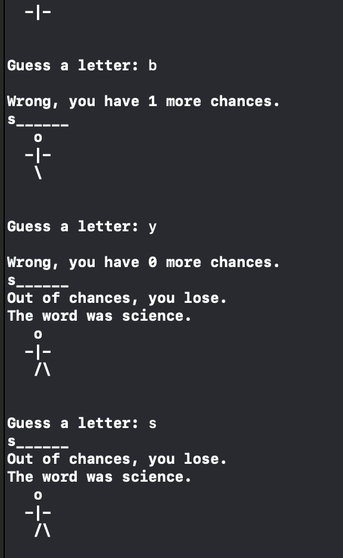

# Description
This program simulates a library book management database.  It allows for simple checkout and return as well as adding and removing entire books from the database.

# Execution
You will need to run the program with Xcode\
'''cmd + r''' to run

# Useful Sites

https://swift.org/documentation/
